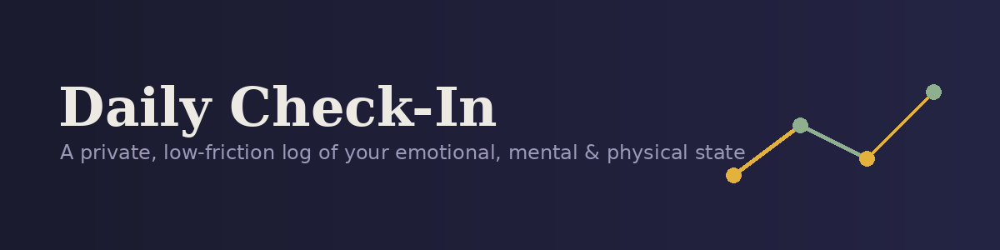
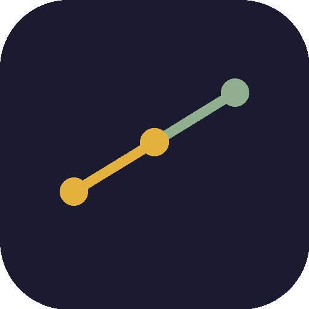

<p align="center">
  
</p>

<p align="center">
  
  
  
  
</p>

A private, low-friction daily log of your emotional, mental, and physical state — built around the same model psychologists use to map mood (valence × arousal), with optional deeper layers for sleep, body, context, and lifestyle. Everything stays on your device. Nothing is sent anywhere.

---

## Contents

- [Why this app](#why-this-app)
- [Quick check-in](#quick-check-in)
- [Optional deeper log](#optional-deeper-log)
- [Trend & Patterns](#trend--patterns)
- [Cross-device sync](#cross-device-sync)
- [Excel file linking](#excel-file-linking)
- [Installing it as an app](#installing-it-as-an-app)
- [Data & privacy](#data--privacy)
- [Browser support](#browser-support)
- [Tech stack](#tech-stack)

---

## Why this app

A single 1–5 mood slider misses most of what actually shapes how you feel. This app is built around a fuller picture of well-being:

| Layer | What it captures |
|---|---|
| **Affect & mood** | Valence (pleasant ↔ unpleasant) and arousal (energy level) — the two axes that, combined, distinguish states like anxiety from sadness, or excitement from calm |
| **Cognitive state** | Mental clarity, racing thoughts, self-talk patterns |
| **Body** | Physical sensations — tension, fatigue, headaches, and other signals of the mind-body connection |
| **Context** | What triggered the state, social connection, screen time, noise |
| **Lifestyle** | Sleep, exercise, caffeine, alcohol, hydration, medication |

The design principle throughout: **logging should take five seconds if you want it to, and never punish you for missing a day.**

---

## Quick check-in

The whole app opens on one card. The fast path:

1. **Tap the affect grid.** Horizontal = how pleasant or unpleasant you feel. Vertical = your energy level. As you tap, the app names the quadrant for you — e.g. *high energy + unpleasant* reads as "anxious or tense," *low energy + pleasant* reads as "calm or content."
2. **Tap any emotion tags that fit** — overwhelmed, grateful, irritable, hopeful, and others. Multi-select, or skip entirely.
3. **Optional note.**
4. **Save entry.**

That's it — nothing else is required to save.

<p align="center"></p>

## Optional deeper log

Click **"Add more detail"** to expand four extra sections, all optional:

- **Mind** — mental clarity slider, racing/looping thoughts, self-talk pattern
- **Body** — muscle tension, headache, fatigue, gut issues, and other sensations
- **Context** — what happened today, social connection level, screen time, noise level
- **Lifestyle** — sleep hours & quality, exercise, caffeine, alcohol, water, medication/supplements

Fill in as much or as little as you like. Every field is optional — the app never blocks a save for a missing field.

> Only one entry per day is kept. Logging again the same day updates that day's entry rather than creating a duplicate.

## Trend & Patterns

- **Trend** plots your valence and energy across your recent entries as a simple line chart.
- **Patterns** compares your average mood across conditions once you have about a week of data — for example, sleep under vs. over 6 hours, or isolated vs. socially connected days. A pattern only shows up when there's a real, consistent gap across enough entries; otherwise it says so plainly rather than guessing from too little data.
- **History** shows a running count of check-ins logged — never a streak, and skipping a day never resets anything.

## Cross-device sync

By default, entries save only on the device you're using (`localStorage`). To have them follow you between your phone and laptop, connect the app to a free [Firebase](https://firebase.google.com/) project — no server to run, no cost at this scale.

1. Go to [console.firebase.google.com](https://console.firebase.google.com) and create a project (free "Spark" plan).
2. **Build → Authentication → Get started** → enable the **Email/Password** sign-in provider.
3. **Build → Firestore Database → Create database** → pick a region close to you.
4. Open the **Rules** tab of Firestore and replace the default rules with:
   ```
   rules_version = '2';
   service cloud.firestore {
     match /databases/{database}/documents {
       match /users/{userId}/entries/{entryId} {
         allow read, write: if request.auth != null && request.auth.uid == userId;
       }
     }
   }
   ```
   This restricts each signed-in account to only ever read or write its own entries.
5. Click the **gear icon → Project settings**, scroll to **Your apps**, click the **`</>`** (web) icon to register a new web app. Copy the `firebaseConfig` object it shows you.
6. Open `index.html`, find the `firebaseConfig` placeholder near the top of the `<script>` section, and paste your real values in over the `"YOUR_..."` placeholders.
7. Re-upload `index.html` (and `sw.js`, so the offline cache picks up the change) to your repo and commit.
8. Open the app, use the new **Sync** card to create an account (email + password), then sign into that same account on your other device. Entries sync automatically and update live on both.

If you skip this setup entirely, the **Sync** card just shows a quiet note and the app keeps working exactly as before, local-only.

## Excel file linking

Every entry saves automatically inside the app (via browser storage), but you can also link a single Excel file that updates itself on every save:

1. Click **Link Excel file** and choose where to save it, once.
2. From then on, hitting **Save entry** writes straight into that same file — no repeated dialogs, no duplicate downloads.
3. Reopening the app later reconnects to the same file automatically (or asks for one click to reconnect, depending on your browser's permission rules).

This uses the browser's **File System Access API**, which is currently only available in **Chrome and Edge on desktop**. On other browsers, use **Download a copy** instead — it exports your full history as one `.xlsx` file any time you want it.

## Installing it as an app

This is a Progressive Web App (PWA) — it can be installed like a native app, with its own icon and window, and it works offline once installed.

1. Host the folder somewhere with `https://` (GitHub Pages, Netlify, etc.) — or run it locally with `python3 -m http.server` and open `http://localhost:PORT`.
2. Open that link in **Chrome or Edge**.
3. Click the **install icon** in the address bar (or "Install app" in the browser menu).
4. It now opens in its own window with a home-screen/start-menu icon, and keeps working without an internet connection.

## Data & privacy

- Without cloud sync set up: all entries stay **local to your browser** (`localStorage`) — nothing is sent anywhere.
- With cloud sync set up: entries are stored in **your own Firebase project**, under your account, protected by the security rules above so only you can read or write them. Anthropic/Claude has no access to this data — it lives entirely in the Firebase project you created.
- The linked Excel file (if you use it) is written **directly to your own disk** by your browser — never uploaded anywhere.
- Clearing your browser's site data erases local-only entries. If you're not using cloud sync, keep your linked Excel file (or periodic "Download a copy" exports) as your backup.

## Browser support

| Feature | Chrome / Edge (desktop) | Firefox | Safari | Mobile browsers |
|---|:---:|:---:|:---:|:---:|
| Quick + detailed logging | ✅ | ✅ | ✅ | ✅ |
| Local auto-save | ✅ | ✅ | ✅ | ✅ |
| Cross-device sync (once configured) | ✅ | ✅ | ✅ | ✅ |
| Manual Excel export | ✅ | ✅ | ✅ | ✅ |
| **Auto-updating linked Excel file** | ✅ | ❌ | ❌ | ❌ |
| Install as app (PWA) | ✅ | ✅ | ✅ (iOS: Add to Home Screen) | ✅ |
| Offline use after install | ✅ | ✅ | ✅ | ✅ |

## Tech stack

- Vanilla HTML/CSS/JS — no build step, no framework
- [Firebase Authentication](https://firebase.google.com/docs/auth) + [Firestore](https://firebase.google.com/docs/firestore) for optional cross-device sync
- [SheetJS](https://sheetjs.com/) for `.xlsx` generation
- File System Access API for direct file writing
- Service Worker + Web App Manifest for offline/installable support

---

<p align="center"><sub>Built for personal use — not a substitute for professional mental health support.</sub></p>
